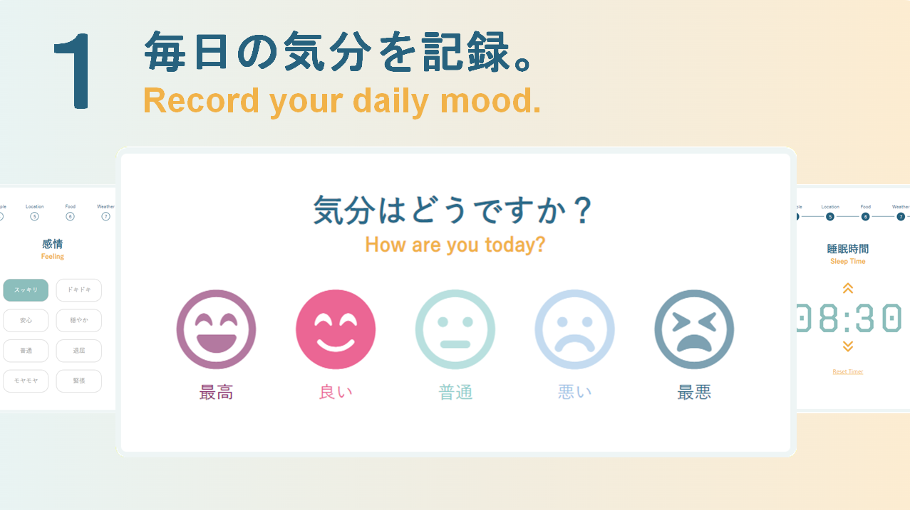
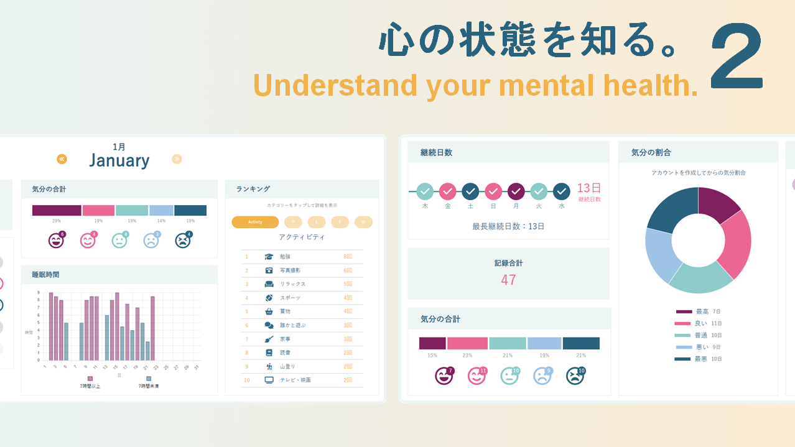
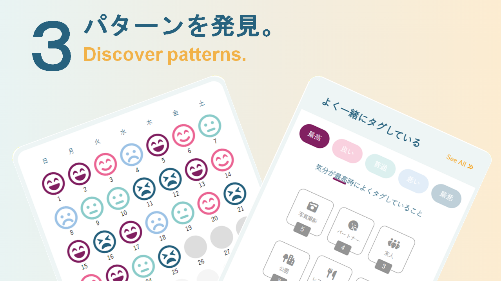
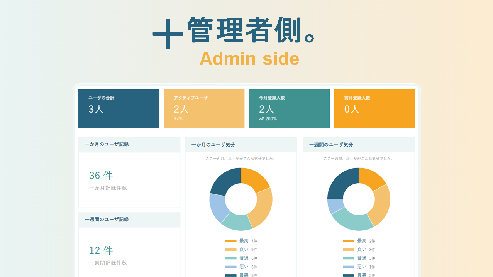

# RETHINK
<div>
  
  
</div>

<div>
  
  
</div>
<br>

**RE:THINK** is a comprehensive mental health tracking application designed to help users reflect on their emotional and mental well-being. This project was developed during my final year at **HAL College of Technology and Design**, where I studied Information Processing Programming.  

The app is designed **in Japanese** to cater to Japanese-speaking users and includes features to track and analyze daily moods, emotions, activities, and sleep patterns, while providing tools such as a calendar and statistical insights.  

### Key Features for Users  
- **Track Daily Well-Being:** Record emotions, activities, and sleep patterns.  
- **Interactive Calendar:** Review past mental states and activities.  
- **Statistical Insights:** Identify trends and relationships between emotions and activities.  
- **Set Personal Goals:** Create goals to encourage positive habits.  
- **Feed and Chat Functionality:** Interact with other users by posting, editing, and chatting in the feed section.  
- **User Authentication:** Secure log-in and registration system for users.  

### Admin Features  
- **Statistics Dashboard:** View aggregated statistics for all users.  
- **User Management:** Maintain and organize user accounts.  
- **Content Management:** Add and manage activity categories, weather data, and other trackable factors for users.  
- **Feed Moderation:** Oversee posts and interactions to ensure safe and positive communication.  
- **Prohibited Words Management:** Manage a list of banned words to maintain a respectful community.  
- **Separate Admin Login:** Secure authentication system for admin accounts.  

**RE:THINK** helps users better understand their mental health, identify triggers, and take steps toward a healthier, more balanced life. The admin side ensures the application remains organized, safe, and effective for all users.  

This project reflects my technical skills and my passion for creating solutions that contribute to people’s well-being. It also represents my journey as an international student in Japan, where I combined my background from Sweden with the knowledge and experiences gained at HAL Tokyo.  

### Limitations  
Currently, the site is **not fully responsive** across all devices. However, I am actively working on implementing responsive design to improve the user experience on mobile and tablet devices.  

## Installation

To get **RE:THINK** up and running on your local machine, follow the steps below:

### 1. Clone the Repository
- First, clone the repository to your local machine. You can do this using the following command:
  ```bash
  git clone https://github.com/moaburke/rethink.git

### 2. Install XAMPP
- Download and install **[XAMPP](https://www.apachefriends.org/index.html)**, which includes Apache, MySQL, and PHP.
- During the installation process, ensure that Apache and MySQL are selected for installation.

### 3. Set Up the Database
- Open **XAMPP** and start **phpMyAdmin** by clicking the **Admin** button next to **MySQL** in the XAMPP Control Panel. This will open phpMyAdmin in your browser.
- In phpMyAdmin, create a new database called **rethink**.
- Import the **rethink.sql** file from the downloaded folder:
  - In phpMyAdmin, select the **rethink** database.
  - Click the **Import** tab.
  - Choose the **rethink.sql** file from the downloaded folder and click **Go** to import it.
  - This will create the necessary tables for the application.

### 4. Create a MySQL User
- In phpMyAdmin, go to the **User Accounts** section.
- Add a new user with the following details:
  - **Username:** guest
  - **Host name:** Any host (use `%` if unsure)
  - **Password:** Select No password
  - Grant **Global privileges** to this user by checking the "Check All" box.
  - Click **Go** to create the user.
    
### 5. Set the Time Zone
- To ensure the correct time zone is set, open the **timezone.php** file located under `server-side/shared/timezone.php`.
- In this file, update the time zone to reflect the location of the user. The current time zone is set to `America/New_York`. Change this to the appropriate time zone for the user (for example, `Europe/Stockholm` for Sweden).


### 6. Adjust Base URL (If Folder Name Is Changed)
- If you change the folder name from **rethink** to something else, you need to adjust the server setup in the following files:
  - **check_login.php**
  - **admin_layout.php**
  - **admin_check_login.php**
  - **user_layout.php**
  
  In each of these files, find the following line:
  ```php
  define('BASE_URL', '/rethink/');

Update `/rethink/` to match the new folder name (e.g., `/newfoldername/`).

### 7. Configure the Website
- Before accessing the website, make sure **Apache** and **MySQL** are started in XAMPP:
  - In the XAMPP Control Panel, click **Start** next to **Apache** and **MySQL**.
- Place the **RE:THINK** project folder into the `htdocs` directory of your XAMPP installation (usually located at `C:\xampp\htdocs\`).
- Access the website by navigating to the following URL in your browser:  
  `http://localhost/rethink/index.php`

### 8. Access the Application
- Once everything is set up, you can access **RE:THINK** locally by going to `http://localhost/rethink/index.php`.
- Log in using the **guest** account, or set up your own user account within the application.

### Notes
- Ensure that **Apache** and **MySQL** are running whenever you want to access the application.
- You may need to tweak your **php.ini** file if you face any PHP-related issues.


## Known Issues
- The app currently does not support dark mode.
- The site is not fully responsive across all devices, and may not display optimally on mobile and tablet screens. This is being worked on to improve the user experience.

## Screenshots

## Technologies Used  
- **HTML5**  
- **CSS3**  
- **JavaScript**  
- **PHP**  
- **MySQL**  
- **Chart.js** (for rendering charts and graphs)
- **XAMPP** (for local development with Apache and MySQL)
- **PHPMyAdmin** (for managing MySQL database)
- **Font Awesome** (for icons)
- **PHP Sessions** (for user authentication and login management)

